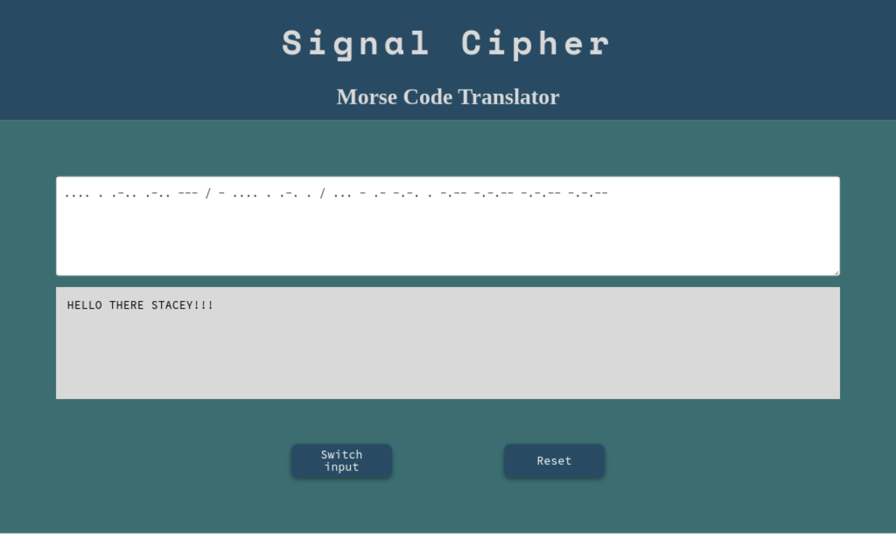
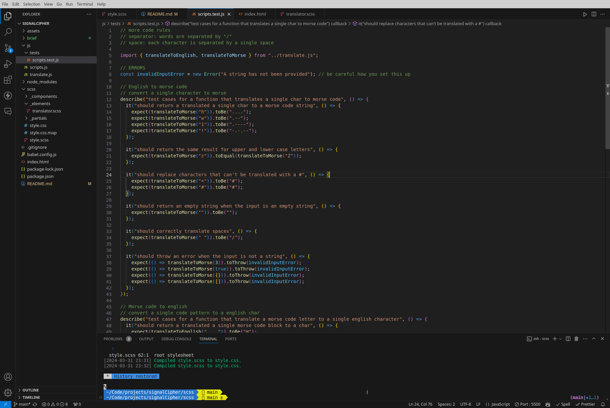

# signalCipher

SignalCipher: Your Morse Code Companion

SignalCipher is a web application that allows users to translate text to Morse code and vice versa. It provides a simple and intuitive interface for decoding and encoding messages using Morse code.

  

 
  
Decode your text at: https://morse.staceyfanner.com

## About the Web App

A fun Morse Code Translator using Vanilla JS, CSS and HTML.

## Usage

You can:

- Enter text in the input field to translate it to Morse code.
- Click the switch input to change the translation language
- Enter Morse code in the input field to translate it to text.
- Click the reset button to clear the input field.

## Planning

### User stories

- I want to translate English to Morse code
- I want to translate Morse code to English
- I want to reset the input

## Key learning highlights

**TDD**:

SignalCipher was my first project where I embraced a true Test-Driven Development approach. By starting with the tests, I had a clear understanding of the requirements for each language translation, such as Morse code's word separation using a specific separator (in my case, '/'). This process allowed me to iteratively develop separate functions to handle translation—one for converting text to Morse code and another for translating Morse code back to English. It was a valuable learning experience and to some degree reduce smelly code.

  

## Challenges

**Event Listener Events**:

Initially, I opted to utilize the "keydown" event listener on the textarea to facilitate real-time translation. However, this approach introduced a variety of issues, necessitating the creation of a separate function to handle key events such as Backspace and Delete. Recognizing the limitations of this approach, I took a step back and conducted further research into alternative event types.

Upon investigation, I discovered that the "input" event proved to be a far more suitable choice. Unlike "keydown," the "input" event is triggered whenever the content of the input element changes, regardless of the source (e.g., keyboard input, paste operation). Adopting this event significantly reduced complexity, as it effectively captured all relevant changes, thereby streamlining the translation process.

## Technologies Used

